# Design Modelling

## UML Models Overview
This model documents the CMS-2567 Compliance Assistant from system boundary through deployment, data movement, persistence, grounded LLM context, and user workflow timing. The architectural views derive from the approved architecture design; the sequence views correspond to UC-001 through UC-007 and UC-009 in [spec.md](./spec.md). Use the architectural views first for structure, then the UC sequence diagrams for behavior and the AI sequence diagrams for model and source-context controls.

---

## Architectural Views

### Component Architecture Diagram
<!-- RENDER type="mermaid" src="./uml-models/component-architecture.png" -->

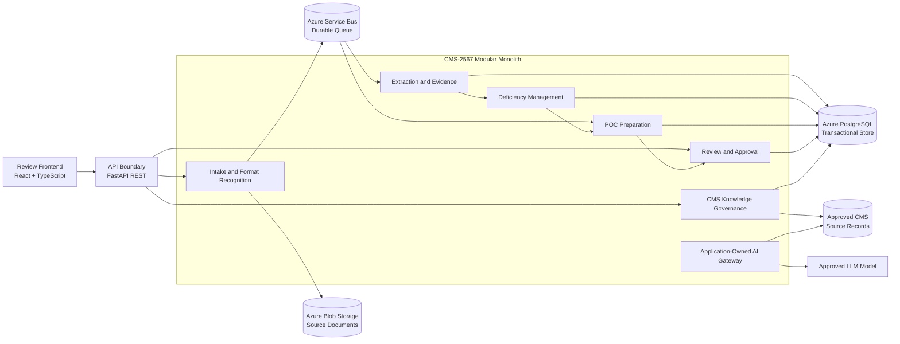

---

### Deployment Architecture Diagram
<!-- RENDER type="plantuml" src="./uml-models/deployment-architecture.png" -->

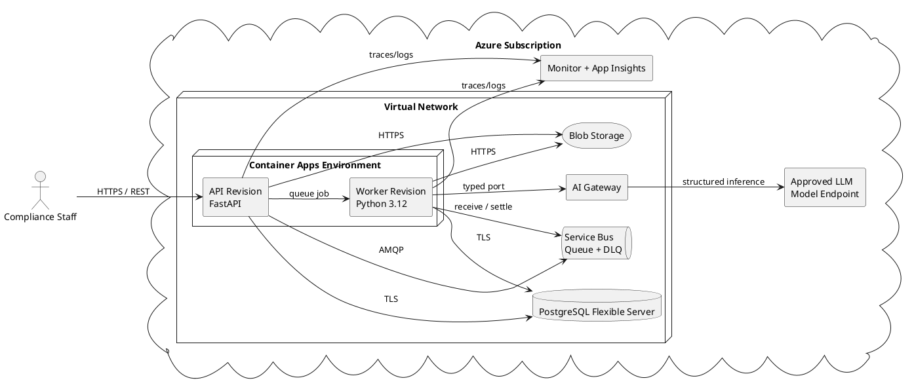

#### Enhanced Deployment Details [CONDITIONAL: infrastructure specification available]
No infrastructure specification artifact is available. Deployment sizing, network address ranges, and service SKUs remain architecture assumptions to confirm during infrastructure planning.

| Component | Specification | Source |
|-----------|---------------|--------|
| Compute | Azure Container Apps with separately scalable API and worker revisions | NFR-002, NFR-007, TR-011 |
| Data | Azure PostgreSQL Flexible Server with point-in-time restore; Blob Storage for source files | DR-005, DR-009, TR-004 |
| Monitoring | Azure Monitor, Application Insights, Log Analytics, OpenTelemetry | NFR-006, NFR-009, TR-011 |

---

### Data Flow Diagram
<!-- RENDER type="plantuml" src="./uml-models/data-flow.png" -->

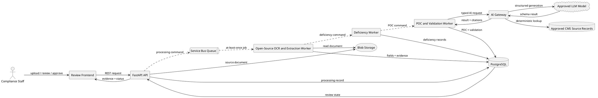

---

### Logical Data Model (ERD)
<!-- RENDER type="mermaid" src="./uml-models/logical-data-model.png" -->

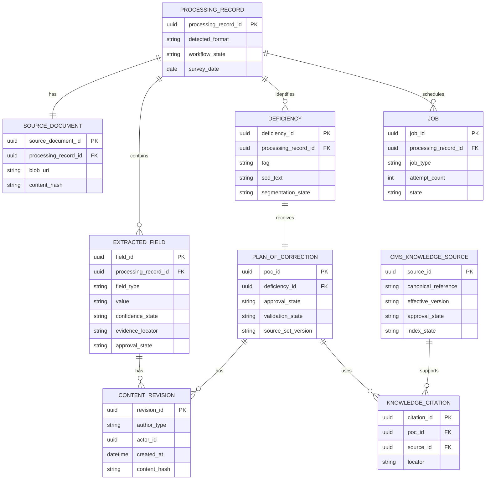

---

### AI Architecture Diagrams [CONDITIONAL: $AI_SIGNAL = true]

#### Grounded LLM Context Pipeline Diagram [CONDITIONAL: grounded LLM pattern identified]
<!-- RENDER type="plantuml" src="./uml-models/rag-pipeline.png" -->

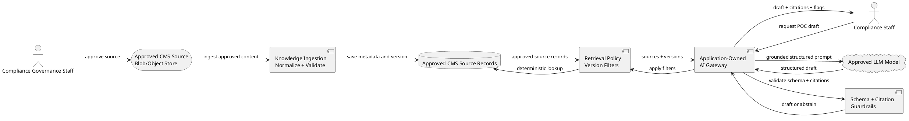

#### AI Sequence Diagram — UC-002 [CONDITIONAL: $AI_SIGNAL = true, repeat per AI-enabled UC]
<!-- RENDER type="mermaid" src="./uml-models/ai-seq-uc-002.png" -->

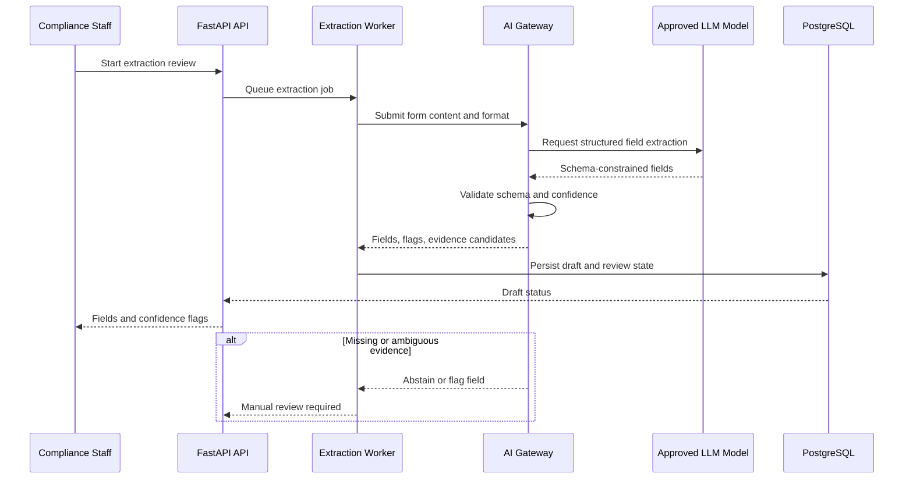

#### AI Sequence Diagram — UC-003 [CONDITIONAL: $AI_SIGNAL = true, repeat per AI-enabled UC]
<!-- RENDER type="mermaid" src="./uml-models/ai-seq-uc-003.png" -->

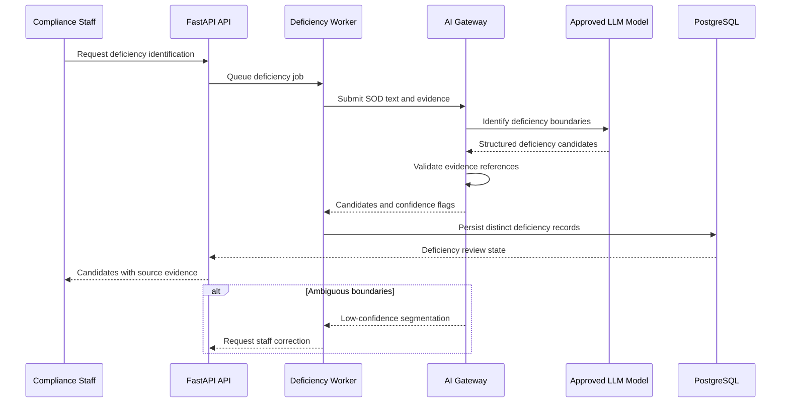

#### AI Sequence Diagram — UC-004 [CONDITIONAL: $AI_SIGNAL = true, repeat per AI-enabled UC]
<!-- RENDER type="mermaid" src="./uml-models/ai-seq-uc-004.png" -->

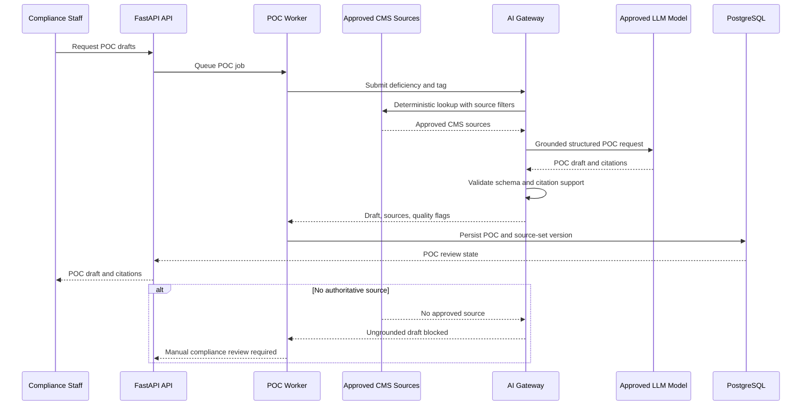

#### AI Sequence Diagram — UC-006 [CONDITIONAL: $AI_SIGNAL = true, repeat per AI-enabled UC]
<!-- RENDER type="mermaid" src="./uml-models/ai-seq-uc-006.png" -->

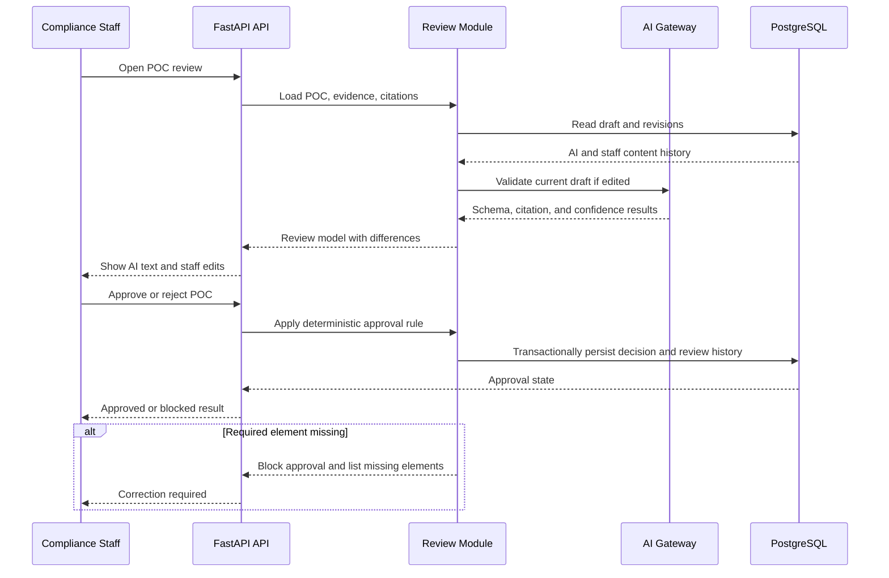

---

## Use Case Sequence Diagrams

### UC-001: Upload and Classify CMS Survey Form
**Source:** [spec.md#uc-001-upload-and-classify-cms-survey-form-sourceinput](./spec.md#uc-001-upload-and-classify-cms-survey-form-sourceinput)

<!-- RENDER type="mermaid" src="./uml-models/seq-uc-001.png" -->

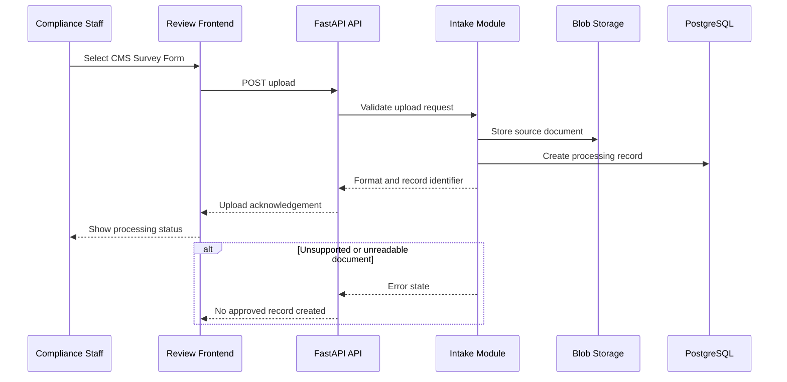

### UC-002: Extract Survey Fields and Link Evidence
**Source:** [spec.md#uc-002-extract-survey-fields-and-link-evidence-sourceinput](./spec.md#uc-002-extract-survey-fields-and-link-evidence-sourceinput)

<!-- RENDER type="mermaid" src="./uml-models/seq-uc-002.png" -->

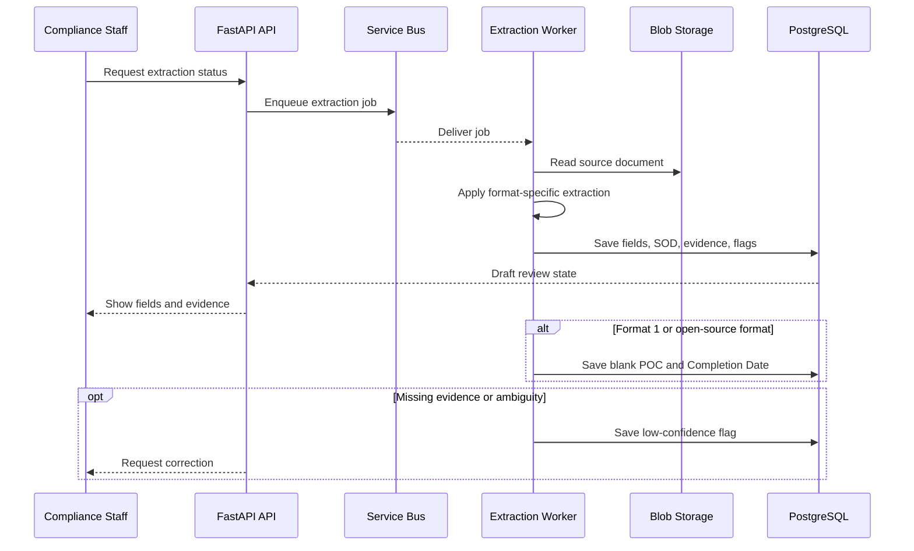

### UC-003: Identify and Organize Deficiencies
**Source:** [spec.md#uc-003-identify-and-organize-deficiencies-sourceinput](./spec.md#uc-003-identify-and-organize-deficiencies-sourceinput)

<!-- RENDER type="mermaid" src="./uml-models/seq-uc-003.png" -->

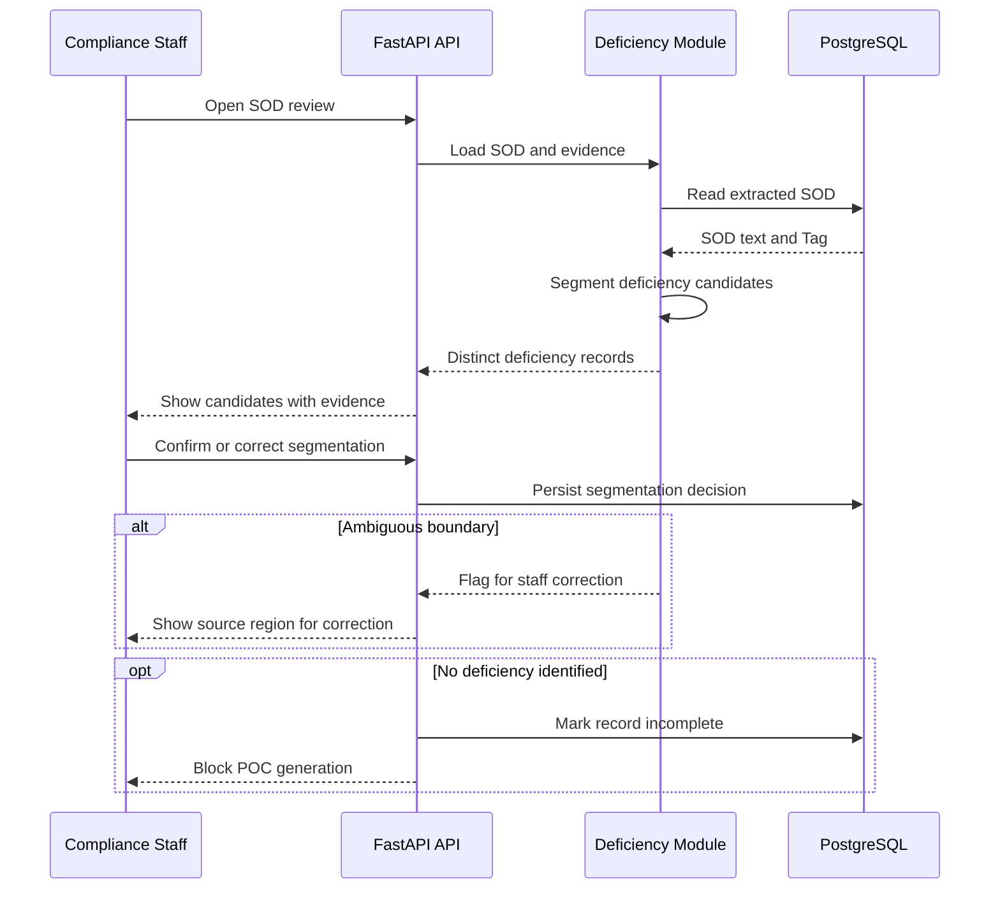

### UC-004: Generate CMS-Grounded POC Drafts
**Source:** [spec.md#uc-004-generate-cms-grounded-poc-drafts-sourceinput](./spec.md#uc-004-generate-cms-grounded-poc-drafts-sourceinput)

<!-- RENDER type="mermaid" src="./uml-models/seq-uc-004.png" -->

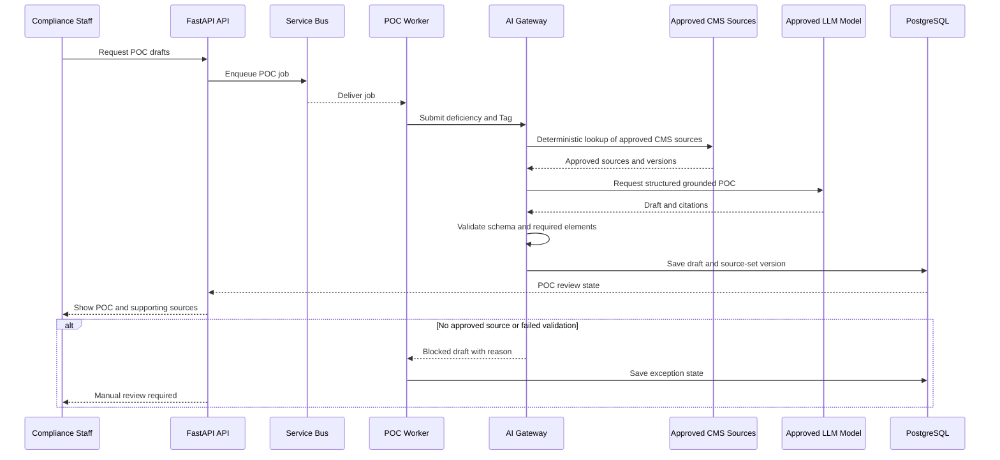

### UC-005: Review and Edit Extracted Content
**Source:** [spec.md#uc-005-review-and-edit-extracted-content-sourceinput](./spec.md#uc-005-review-and-edit-extracted-content-sourceinput)

<!-- RENDER type="mermaid" src="./uml-models/seq-uc-005.png" -->

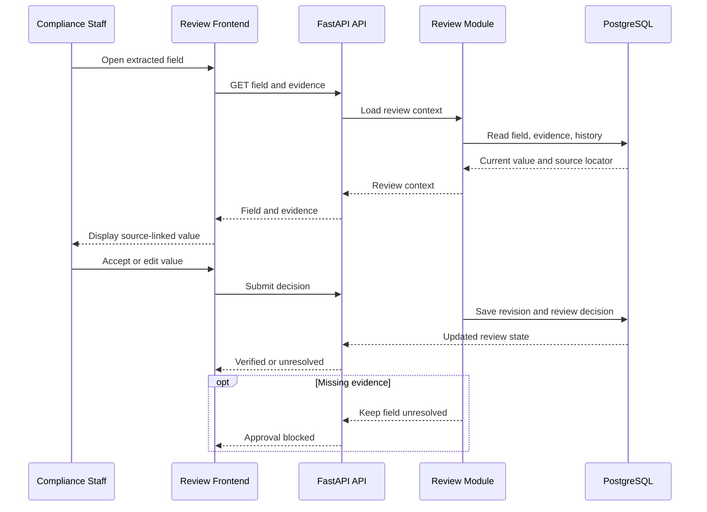

### UC-006: Review, Edit, and Approve POCs
**Source:** [spec.md#uc-006-review-edit-and-approve-pocs-sourceinput](./spec.md#uc-006-review-edit-and-approve-pocs-sourceinput)

<!-- RENDER type="mermaid" src="./uml-models/seq-uc-006.png" -->

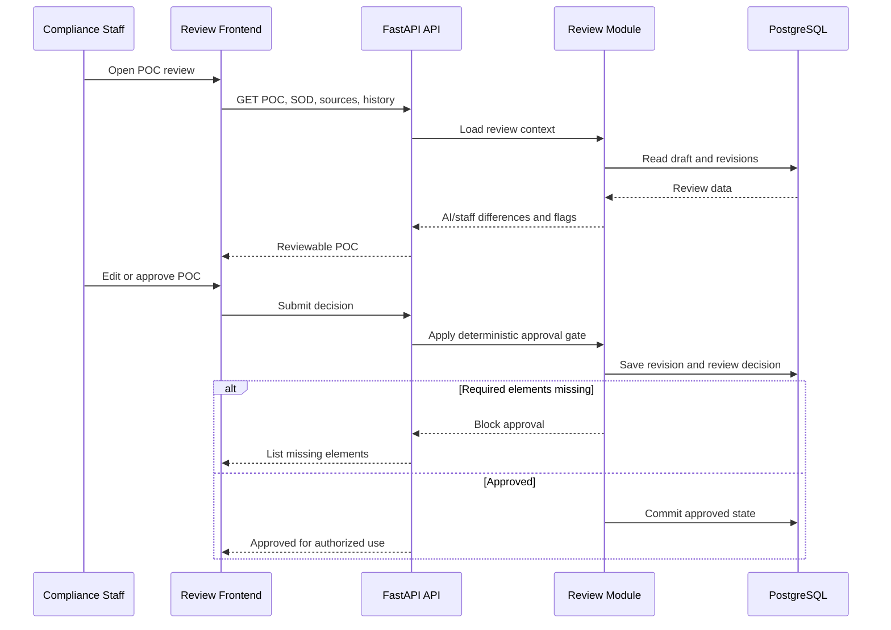

### UC-007: Maintain CMS Knowledge Sources and POC Rubric
**Source:** [spec.md#uc-007-maintain-cms-knowledge-sources-and-poc-rubric-sourceinput](./spec.md#uc-007-maintain-cms-knowledge-sources-and-poc-rubric-sourceinput)

<!-- RENDER type="mermaid" src="./uml-models/seq-uc-007.png" -->

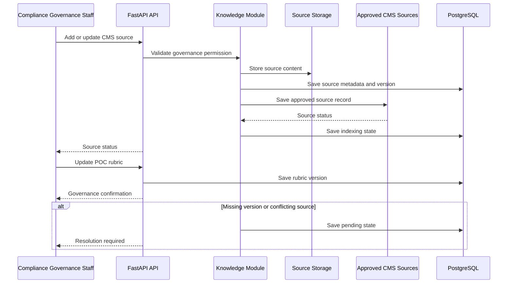

### UC-009: Supply Pilot Evidence and Measure Outcomes
**Source:** [spec.md#uc-009-supply-pilot-evidence-and-measure-outcomes-sourceinput](./spec.md#uc-009-supply-pilot-evidence-and-measure-outcomes-sourceinput)

<!-- RENDER type="mermaid" src="./uml-models/seq-uc-009.png" -->

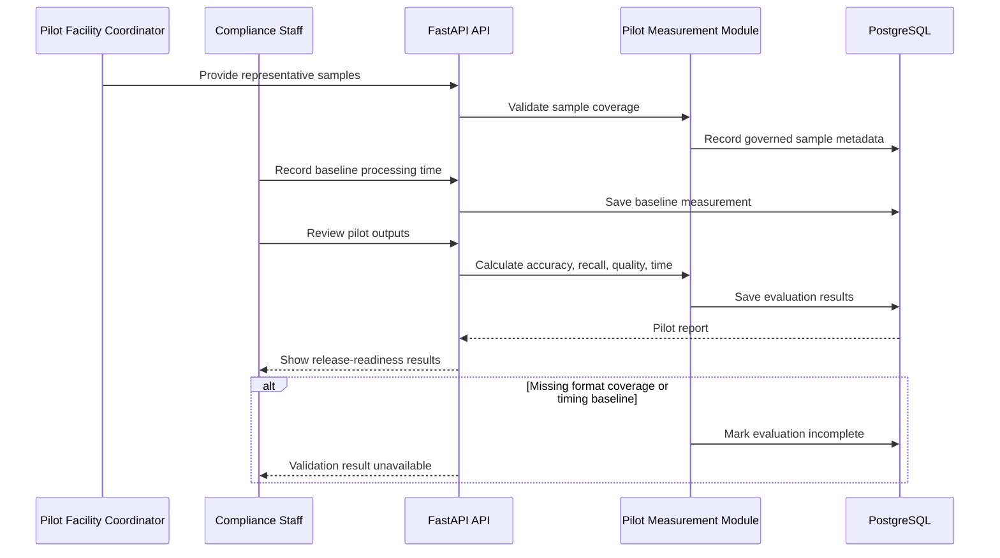
