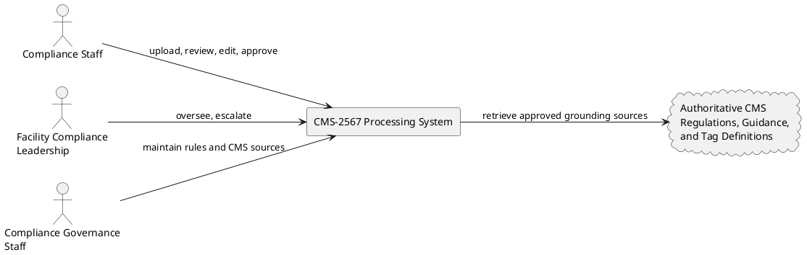
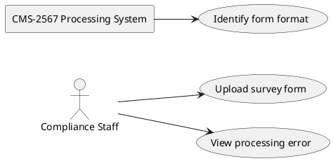
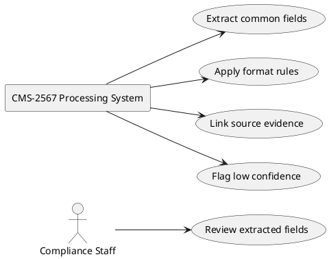
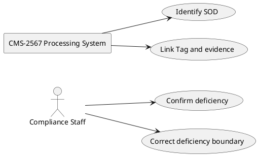
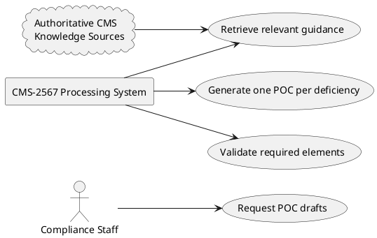
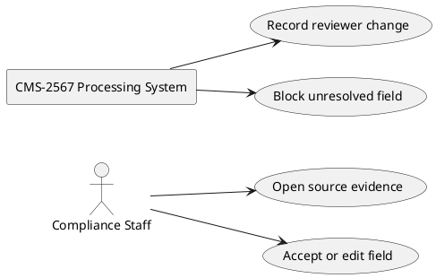
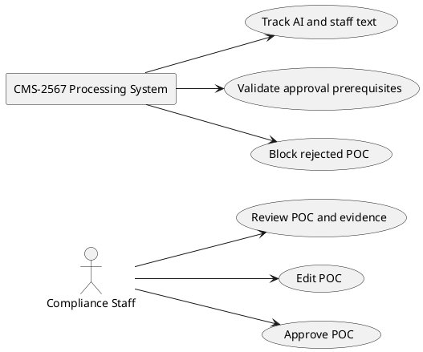
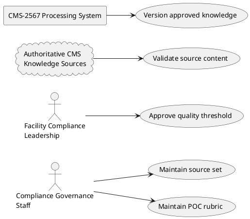
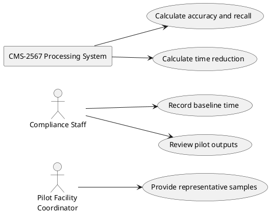

# Requirements Specification

## Feature Goal
Build a review-controlled CMS-2567 processing solution for nursing-home compliance staff. The product will replace manual survey-form review and first-draft preparation with format-aware extraction, deficiency identification, source-linked evidence, and separate CMS-grounded POC drafts, while keeping staff approval mandatory before use or submission.

## Business Justification
- Reduce average staff processing time per CMS-2567 by at least 50% while preserving reviewer-verified accuracy and compliant POCs.
- Give compliance staff and nursing-home leadership a consistent, traceable workflow for moving from survey findings to corrective-action drafts.
- Reduce manual effort spent locating Provider Name, Provider Number, Survey Date, Tag, SOD, and conditional POC and Completion Date values.
- Reduce the risk of incomplete, unsupported, or inconsistently worded POCs through source evidence, required-element checks, authoritative CMS knowledge, and approval history.

## Feature Scope
The product will accept the three specified CMS Survey Form formats, identify the format, extract common fields, identify each SOD, and draft a separate POC for each deficiency. Format 2 may provide POC and Completion Date values; Format 1 and the open-source format must leave those fields empty when they are not part of the form. The product will provide evidence-linked review, CMS knowledge grounding, staff approval controls, and change history.

### Success Criteria
- [ ] Average staff processing time per CMS-2567 is at least 50% lower than the documented baseline during a representative pilot.
- [ ] 100% of extracted fields and POCs have documented compliance-staff verification and approval before use or submission.
- [ ] Field-level extraction accuracy is at least 95% across a validated test set covering all three formats.
- [ ] Deficiency/SOD recall is at least 95% across the validated test set.
- [ ] Format 2 POC and Completion Date extraction meets the agreed accuracy threshold, while those fields remain blank for Format 1 and the open-source format.
- [ ] Generated POCs meet the minimum CMS-compliance and quality score established by compliance subject-matter experts and facility compliance leadership.
- [ ] 100% of approved outputs retain source evidence, AI-versus-staff change history, and approval details.

## Functional Requirements

### Intake and Format Recognition
- FR-001: [DETERMINISTIC] [SOURCE:INPUT] System MUST accept an uploaded CMS Survey Form in each of the three supported formats.
  Basis: The brainstorm explicitly includes processing all three specified formats.
- FR-002: [DETERMINISTIC] [SOURCE:INPUT] System MUST identify whether an uploaded form is Format 1, Format 2, or the open-source format before applying format-specific extraction rules.
  Basis: The brainstorm requires format identification and different field behavior by format.
- FR-003: [DETERMINISTIC] [SOURCE:INPUT] System MUST reject or route an unreadable or unsupported document to an error state without creating an approved record.
  Basis: A controlled exception path is required to prevent unreliable processing from entering the approval workflow.

### Survey Field Extraction and Evidence
- FR-004: [HYBRID] [SOURCE:INPUT] System MUST draft Provider Name, Provider Number, Survey Date, Tag, and SOD values from every supported form for staff review.
  Basis: The brainstorm defines these as common OCR fields across all formats.
- FR-005: [HYBRID] [SOURCE:INPUT] System MUST draft Plan of Correction and Completion Date values when the identified form is Format 2.
  Basis: The brainstorm specifies conditional extraction of these fields for Format 2.
- FR-006: [DETERMINISTIC] [SOURCE:INPUT] System MUST leave Plan of Correction and Completion Date empty when the identified form is Format 1 or the open-source format.
  Basis: The brainstorm explicitly requires both fields to remain empty for these formats.
- FR-007: [HYBRID] [SOURCE:INPUT] System MUST associate each drafted field value and SOD with source-linked evidence that allows staff to locate the originating form content.
  Basis: Source-linked evidence is a confirmed product capability and traceability requirement.
- FR-008: [HYBRID] [SOURCE:INPUT] System MUST mark a field as incomplete or low-confidence when the source content is missing, ambiguous, or not reliably extracted.
  Basis: The brief requires low-confidence and incomplete-content flags before approval.

### Deficiency and POC Preparation
- FR-009: [HYBRID] [SOURCE:INPUT] System MUST identify and present each SOD as a distinct deficiency record.
  Basis: The brief requires deficiency identification and separate handling for each deficiency.
- FR-010: [HYBRID] [SOURCE:INPUT] System MUST draft one separate POC for every identified deficiency.
  Basis: The brief explicitly requires a separate POC for each deficiency.
- FR-011: [HYBRID] [SOURCE:INPUT] System MUST ground each POC draft in the maintained authoritative CMS regulations, guidance, and tag definitions relevant to the deficiency.
  Basis: CMS regulatory knowledge retrieval through RAG is a confirmed capability.
- FR-012: [DETERMINISTIC] [SOURCE:INPUT] System MUST validate each POC draft against the required POC elements defined by the approved compliance rubric.
  Basis: Required-element validation and an expert-defined quality threshold are confirmed requirements.
- FR-013: [HYBRID] [SOURCE:INPUT] System MUST show the CMS sources or source references used to support material recommendations in each POC draft.
  Basis: Evidence-linked grounding is necessary for staff to validate CMS-aligned draft content.

### Review, Approval, and Traceability
- FR-014: [DETERMINISTIC] [SOURCE:INPUT] System MUST require a designated CMS compliance staff member to verify every extracted field before the record can be marked approved.
  Basis: The brief requires staff verification and documented approval for every extracted result.
- FR-015: [HYBRID] [SOURCE:INPUT] System MUST require a designated CMS compliance staff member to review and approve every POC before the POC can be used or submitted.
  Basis: Human approval before use or submission is a non-negotiable workflow boundary.
- FR-016: [DETERMINISTIC] [SOURCE:INPUT] System MUST record whether each displayed value or POC passage was generated by AI or edited by staff.
  Basis: AI-versus-staff change tracking is a confirmed capability.
- FR-017: [DETERMINISTIC] [SOURCE:INPUT] System MUST retain review history containing the reviewer, decision, timestamp, changed content, and approval status for each field and POC.
  Basis: Review history and documented approval are confirmed traceability requirements.

### CMS Knowledge and Governance
- FR-018: [DETERMINISTIC] [SOURCE:INPUT] System MUST allow authorized compliance governance staff to maintain the authoritative CMS regulations, guidance, and tag-definition source set used for POC grounding.
  Basis: Retrieval and maintenance of authoritative CMS knowledge is explicitly in scope.
- FR-019: [DETERMINISTIC] [SOURCE:INPUT] System MUST identify the source-set version or effective date used for each generated POC.
  Basis: Version traceability is required to explain which authoritative guidance supported an approved draft.

- FR-024: [DETERMINISTIC] [SOURCE:INPUT] System MUST prevent export or submission of a record when any required field or POC lacks documented approval.
  Basis: The brief requires every result to be approved before use or submission, and the product is out of scope for automatic submission.

## Use Case Analysis

### Actors & System Boundary
- Compliance Staff: Primary actor who uploads forms, verifies extracted values, reviews POCs, edits drafts, approves outputs, and responds to flags.
- Facility Compliance Leadership: Secondary actor who establishes quality expectations, reviews escalations, and oversees facility compliance work.
- Compliance Governance Staff: Business actor who approves POC validation rules and maintains authoritative CMS knowledge sources.
- Pilot Facility Coordinator: Business/supporting actor who supplies representative historical samples and baseline staff-time measurements.
- Authoritative CMS Knowledge Sources: External system actor represented by current CMS regulations, guidance, and tag definitions used as grounding material.
- CMS-2567 Processing System: System boundary that accepts documents, identifies formats, extracts and links evidence, identifies deficiencies, drafts and validates POCs, manages review state, and preserves review records. It does not determine legal compliance or submit POCs automatically.

### System Context Diagram
<!-- RENDER type="plantuml" src="system-context.puml" -->

### Use Case Specifications

#### UC-001: Upload and Classify CMS Survey Form [SOURCE:INPUT]
- **Actor(s)**: Compliance Staff
- **Parent Requirements**: FR-001, FR-002, FR-003
- **Goal**: Start a CMS-2567 processing record using one of the three supported formats.
- **Preconditions**: The staff member is authenticated and has permission to create a processing record.
- **Success Scenario**:
  1. The staff member uploads a CMS Survey Form.
  2. The system checks that the document is readable and identifies its supported format.
  3. The system creates a processing record with the detected format and review status.
- **Extensions/Alternatives**:
  - 2a. If the document is unreadable or unsupported, the system rejects it or routes it to an error state and explains that no approved record was created.
  - 3a. If the staff member lacks permission, the system denies the action and records the access attempt.
- **Postconditions**: A valid upload is ready for format-specific extraction, or a rejected upload remains unavailable for approval.
- **Basis**: The brainstorm confirms three supported formats and format identification; the error and access paths are controlled workflow inferences.

##### Use Case Diagram
<!-- RENDER type="plantuml" src="uc-upload-classify.puml" -->

#### UC-002: Extract Survey Fields and Link Evidence [SOURCE:INPUT]
- **Actor(s)**: Compliance Staff
- **Parent Requirements**: FR-004, FR-005, FR-006, FR-007, FR-008
- **Goal**: Obtain a reviewable draft of survey fields, conditional fields, SOD content, and source evidence.
- **Preconditions**: A valid processing record has a detected format.
- **Success Scenario**:
  1. The system extracts common fields and applies the format-specific POC and Completion Date rule.
  2. The system associates each extracted value and SOD with source evidence.
  3. The system marks incomplete or low-confidence values for staff attention.
- **Extensions/Alternatives**:
  - 1a. If Format 1 or the open-source format is detected, the system leaves POC and Completion Date empty.
  - 2a. If source evidence cannot be located, the system marks the value incomplete and prevents approval until resolved.
  - 3a. If extraction produces ambiguous text, the system presents the source region and requests staff correction.
- **Postconditions**: A field-level draft exists with format rules, evidence links, and review flags.
- **Basis**: All extraction and conditional-field behaviors are explicit; low-confidence handling is supported by the confirmed validation capability.

##### Use Case Diagram
<!-- RENDER type="plantuml" src="uc-extract-evidence.puml" -->

#### UC-003: Identify and Organize Deficiencies [SOURCE:INPUT]
- **Actor(s)**: Compliance Staff
- **Parent Requirements**: FR-009
- **Goal**: View each SOD as a distinct deficiency that can receive its own corrective-action draft.
- **Preconditions**: SOD content has been extracted or entered for review.
- **Success Scenario**:
  1. The system identifies deficiency boundaries and assigns each deficiency a record.
  2. The system displays each deficiency with its Tag and source evidence.
  3. The staff member confirms or corrects the deficiency segmentation.
- **Extensions/Alternatives**:
  - 1a. If boundaries are ambiguous, the system flags the record and presents the relevant source content for staff correction.
  - 3a. If no deficiency can be identified, the system marks the record incomplete and blocks POC generation.
- **Postconditions**: Confirmed deficiencies are individually available for POC drafting, with unresolved records clearly flagged.
- **Basis**: Separate deficiency handling is explicit; segmentation and no-deficiency handling are necessary review behaviors derived from the stated goal.

##### Use Case Diagram
<!-- RENDER type="plantuml" src="uc-organize-deficiencies.puml" -->

#### UC-004: Generate CMS-Grounded POC Drafts [SOURCE:INPUT]
- **Actor(s)**: Compliance Staff
- **Parent Requirements**: FR-010, FR-011, FR-012, FR-013, FR-019
- **Goal**: Produce a separate, evidence-supported POC draft for every confirmed deficiency.
- **Preconditions**: At least one deficiency is confirmed and the approved CMS knowledge source set is available.
- **Success Scenario**:
  1. The staff member requests POC drafts for confirmed deficiencies.
  2. The system retrieves relevant authoritative CMS sources and tag definitions.
  3. The system generates one POC draft per deficiency and displays supporting source references.
  4. The system validates required POC elements and records the source-set version or effective date.
- **Extensions/Alternatives**:
  - 2a. If no authoritative source is available, the system marks the draft as ungrounded and blocks approval.
  - 3a. If a draft cannot be generated, the system records the deficiency-specific error and leaves the deficiency available for manual drafting.
  - 4a. If required elements are missing, the system flags the draft and blocks approval until corrected.
- **Postconditions**: Each confirmed deficiency has a CMS-grounded draft or an explicit exception state; no draft is approved automatically.
- **Basis**: Separate POCs, CMS knowledge grounding, required-element checks, and expert quality review are explicit; source-version capture is a traceability inference.

##### Use Case Diagram
<!-- RENDER type="plantuml" src="uc-generate-poc.puml" -->

#### UC-005: Review and Edit Extracted Content [SOURCE:INPUT]
- **Actor(s)**: Compliance Staff
- **Parent Requirements**: FR-007, FR-008, FR-014, FR-016, FR-017
- **Goal**: Verify extracted fields against source evidence and correct them when necessary.
- **Preconditions**: An extraction draft exists and the staff member has review permission.
- **Success Scenario**:
  1. The staff member opens a field and its source evidence.
  2. The staff member accepts the value or edits it.
  3. The system records the staff change, reviewer identity, timestamp, and decision.
  4. The staff member verifies every required field.
- **Extensions/Alternatives**:
  - 1a. If evidence is missing, the system keeps the field unresolved and blocks approval.
  - 2a. If the staff member rejects a value, the system requires a replacement or reason before continuing.
  - 4a. If any required field remains unverified, the record cannot move to approved status.
- **Postconditions**: Each field is verified or remains visibly unresolved with a review record.
- **Basis**: Staff verification, evidence links, change tracking, and review history are explicit; rejection handling is a necessary control inference.

##### Use Case Diagram
<!-- RENDER type="plantuml" src="uc-review-fields.puml" -->

#### UC-006: Review, Edit, and Approve POCs [SOURCE:INPUT]
- **Actor(s)**: Compliance Staff
- **Parent Requirements**: FR-010, FR-012, FR-013, FR-015, FR-016, FR-017, FR-024
- **Goal**: Turn each generated POC into an approved output through documented expert review.
- **Preconditions**: A deficiency-specific POC draft exists and its required elements have been evaluated.
- **Success Scenario**:
  1. The staff member reviews the POC alongside the SOD and supporting CMS references.
  2. The staff member edits text or accepts generated text as appropriate.
  3. The system distinguishes AI-generated passages from staff edits and records each change.
  4. The staff member approves the complete POC.
  5. The system makes the approved POC available for use while retaining the review history.
- **Extensions/Alternatives**:
  - 1a. If CMS support or source evidence is insufficient, the staff member returns the POC for correction.
  - 2a. If required POC elements are missing, the system blocks approval and identifies the missing elements.
  - 4a. If the staff member rejects the POC, the system records the rejection and keeps it unavailable for use or submission.
- **Postconditions**: The POC is approved with reviewer identity and history, or remains blocked with a documented review outcome.
- **Basis**: Human approval, change tracking, required-element validation, and pre-use blocking are explicit.

##### Use Case Diagram
<!-- RENDER type="plantuml" src="uc-approve-poc.puml" -->

#### UC-007: Maintain CMS Knowledge Sources and POC Rubric [SOURCE:INPUT]
- **Actor(s)**: Compliance Governance Staff, Facility Compliance Leadership
- **Parent Requirements**: FR-011, FR-012, FR-013, FR-018, FR-019
- **Goal**: Keep the authoritative CMS source set and internal POC quality rubric current and usable for review.
- **Preconditions**: An authorized governance user is authenticated and source-maintenance permissions are available.
- **Success Scenario**:
  1. The governance user adds, updates, retires, or approves a CMS source or tag definition.
  2. The system records the source identity, effective date or version, and maintenance decision.
  3. The governance user defines or updates the required POC elements and minimum expert-review score.
  4. The system uses only approved source-set content for new POC grounding.
- **Extensions/Alternatives**:
  - 1a. If a source conflicts with an approved source, the system keeps it pending and prevents use until governance resolves the conflict.
  - 2a. If a source lacks an effective date or version, the system marks it incomplete and prevents it from becoming authoritative.
  - 4a. Existing approved POCs retain the source-set version used at approval.
- **Postconditions**: Approved current knowledge and rubric rules are available for future POC drafts, with maintenance history retained.
- **Basis**: Authoritative knowledge retrieval and maintenance are explicit; approval states, conflict handling, and source versioning are governance inferences.

##### Use Case Diagram
<!-- RENDER type="plantuml" src="uc-maintain-knowledge.puml" -->

#### UC-009: Supply Pilot Evidence and Measure Outcomes [SOURCE:INPUT]
- **Actor(s)**: Pilot Facility Coordinator, Compliance Staff
- **Parent Requirements**: FR-001, FR-004, FR-009, FR-010, FR-014, FR-015
- **Goal**: Provide representative samples and baseline measurements needed to validate accuracy, recall, quality, and time reduction.
- **Preconditions**: Pilot facilities are selected and approved sample-handling rules are available.
- **Success Scenario**:
  1. The coordinator supplies representative historical CMS-2567 samples for all supported formats.
  2. Staff record baseline processing times using the approved measurement method.
  3. The pilot processes the samples and records extraction, SOD recall, POC quality, approval, and processing-time results.
  4. The product owner compares results with the agreed success criteria.
- **Extensions/Alternatives**:
  - 1a. If samples are not representative or lack required format coverage, the system marks the validation set incomplete.
  - 2a. If baseline timing data is missing, the time-reduction result remains unvalidated.
  - 3a. If a sample contains sensitive content outside approved handling rules, the coordinator withdraws or de-identifies it before processing.
- **Postconditions**: A governed pilot dataset and outcome report support or reject release readiness against the stated criteria.
- **Basis**: Representative samples and time measurements are an explicit assumption; validation workflow details are derived to make the success criteria measurable.

##### Use Case Diagram
<!-- RENDER type="plantuml" src="uc-measure-pilot.puml" -->

## Risks & Mitigations
- OCR or format misclassification could create incorrect fields or omit conditional fields: require format-specific validation, source evidence, confidence flags, and staff approval.
- Generated POCs could be incomplete or unsupported by current CMS guidance: ground drafts in approved authoritative sources, validate required elements, show supporting references, and require expert approval.
- Outdated or conflicting CMS knowledge could affect POC quality: assign governance ownership, maintain versions/effective dates, and block unapproved sources from grounding.
- Pilot results could be unreliable: require representative samples across all formats, baseline timings, documented measurement methods, and expert-reviewed quality scoring.
- Staff may over-rely on AI output: block use or submission until every field and POC has documented staff approval and clearly show AI-generated versus staff-edited content.

## Constraints & Assumptions
- The initial release is limited to the three specified CMS Survey Form formats; unsupported formats enter a controlled error state.
- Provider Name, Provider Number, Survey Date, Tag, and SOD are expected across all formats; Plan of Correction and Completion Date are extracted only for Format 2 and remain empty for Format 1 and the open-source format.
- POC quality is judged against a minimum score defined by a compliance subject-matter expert and facility compliance leadership, not assumed to be defined by CMS.
- All extracted fields and POCs require designated compliance-staff verification and documented approval before use or submission.
- The product drafts and supports review but does not determine legal compliance, execute corrective actions, or submit POCs automatically to CMS.
- Pilot facilities will provide representative historical samples and baseline staff-time measurements.
- Authoritative CMS regulations, guidance, and tag definitions require an approved maintenance owner and source-version record.
